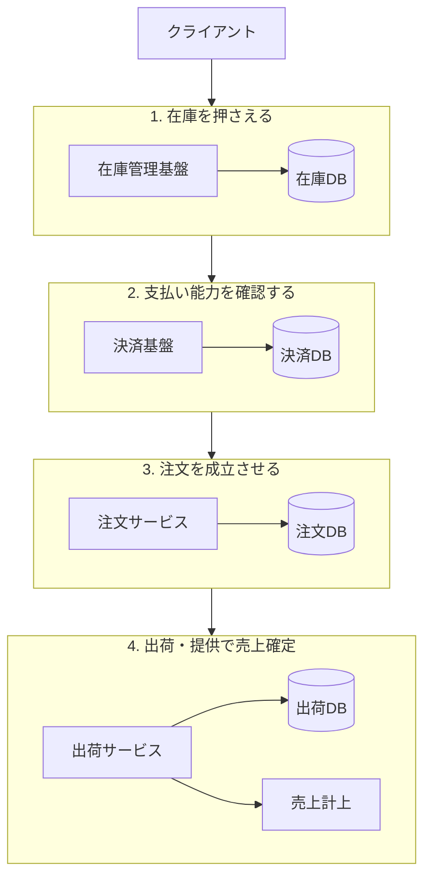
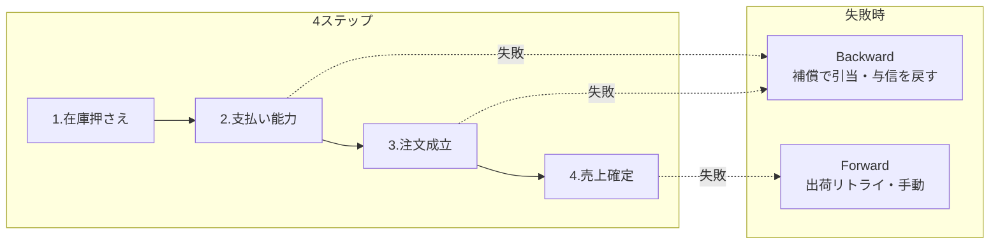

## はじめに

突然ですが皆さん！Sagaパターンって、知ってますか？
**SEGAじゃないしロマサガでもないです。もちろん、はなわの方でもありません。**

どこか知っているようで実はあんまりわかっていない、今回はそんな「Sagaパターン」のお話。

:::message
本記事は教科書的な完璧を目指すより、調べて腑に落ちたことを共有するスタンスで書いています。
また本記事はAIに２割ぐらいは手伝ってもらっています。
:::

## とあるECサイトで起きた話

先日僕がレビューしていたのは、マイクロサービスで構成されたECサービスの注文まわりでした。  
サービスをまたぐ処理で「例外時のサービス間の整合性、どうするのがいいかねぇ」という話のあと、メンバーがSagaパターンを使ったPRを出してきました。

**ぼく「あぁ...ほーん......Saga...ね...はいはい......たしかにねー...」（やばい）（あいまい）（なんだっけ）**

名前は知ってますが「あれでしょ？分散トランザクションのやつだよね？」くらいの理解です。

とはいえレビュワー。ノールックでApproveするなんて言語道断。
これを機にちゃんと理解ろう（わかろう）と思い、ちょうどいいし記事にしようか！という感じでございます。

## 境界をまたぐと、1本のトランザクションで囲めない

マイクロサービスではサービスごとに DB が分かれていることが多いので、サービス間で互いに連携しながら行われる処理は単一のトランザクションで囲めません。

古典的な解として 2 フェーズコミット（2PC）と呼ばれる手法がありますが、こちらはサービスが増えれば増えるほどロックが長くなるなどの欠点があります。

:::message
２フェーズコミット：すべてのDBが更新可能であれば更新、できなければ更新しないというもの。
:::

一方 Saga パターンでは「結果整合性」を重視します。最終的に整合性の取れた状態であれば、途中で一時的にズレていても構わない、という考え方です。

Saga 自体の定義はシンプルで、**複数のローカルトランザクションに分割した処理について、各ステップごとに失敗時の扱いをセットで設計する** パターンです。失敗時に自動で DB ロールバックされるわけではなく、**補償トランザクション**（打ち消すための別トランザクション）やリトライ、手動介入を設計者が用意します。

## 在庫を押さえたあとに失敗したら、全部無かったことにする？

多分そう。部分的にそう。（ランプの魔人）
...という冗談はさておき。

**「全部なかったことにする」がデフォルトとは限りません。** 要件によってはそうなることもありますが、Saga でまず決めるのは **「このステップが失敗したら、最終的にどんな状態であればよいか」** です。

僕がレビューした EC では、注文処理がだいたい次の4段階で進みます。

```
1. 在庫を押さえる
2. 支払い能力を確認する
3. 注文を成立させる
4. 出荷・提供できる段階で売上を確定する
```

「決済してから在庫」ではなく、**先に在庫（または引当枠）を押さえてから支払い能力を見る** 順番です。マイクロサービスに分かれているので、この4段階を1本のトランザクションでは囲めません。Saga はこの4段階を、ステップごとに失敗の扱い付きでつなぐ設計になります。

## 例題：4ステップの注文フローを Saga で組む

ここからが本題です。関わるサービスと Saga の設計を、フローに沿って見ていきます。

### 全体像

| 順番 | ビジネス上のステップ | 担当サービス | Saga で決めること |
| --- | --- | --- | --- |
| 1 | 在庫を押さえる | 在庫管理基盤 | 失敗時はここで止まる。成功時の引当をどう解放するか |
| 2 | 支払い能力を確認する | 決済基盤 | 与信・オーソリ。失敗時は在庫引当を戻すか |
| 3 | 注文を成立させる | 注文サービス | **Pivot** 候補。ここを過ぎたら「なかったこと」ではなく注文として残る |
| 4 | 出荷・提供できる段階で売上確定 | 出荷サービス ＋ 売上計上 | 失敗時は返金ではなくリトライ・手動が多い |



各ステップはローカルトランザクションとして **即コミット** されます。だから「途中まで成功した状態」が他のサービスから見えます。Saga には ACID の Isolation がない、と言われるのはこのためです。

### ステップ1：在庫を押さえる

商品ページの表示用在庫と、倉庫側の引当は歴史的経緯で別サービス・別 DB になっていることが多いです（最初は同一 DB だった、という話はよく聞きます）。

このステップでは **販売可能在庫の引当** または **受注枠の確保** を行います。

- 成功時の状態例：`INVENTORY_RESERVED`
- 失敗時：そもそも次に進まない。補償は不要
- 種類：**Compensable**（次のステップに進んだあと、打ち消す必要が出る）

### ステップ2：支払い能力を確認する

ここではまだ売上確定ではありません。**与信確保・オーソリ** のように「このユーザーは支払えるか」を確認します。

- 成功時の状態例：`PAYMENT_AUTHORIZED`
- 失敗時の補償：ステップ1の在庫引当を解放（Backward Recovery）
- 種類：**Compensable**

:::message alert
「支払い能力の確認」と「売上確定」は別ステップです。ステップ2の失敗で、すでに確定した売上まで戻す必要は通常ありません（そこまで到達していないから）。
:::

### ステップ3：注文を成立させる

在庫と支払い能力が揃ったら、注文レコードを **成立状態** にします。お客さんから見ると「注文が受け付けられた」タイミングに近いです。

- 成功時の状態例：`ORDER_CONFIRMED`
- 失敗時：在庫解放 ＋ 与信解放（ステップ1・2の補償）
- 種類：**Pivot 候補**。ここを過ぎると「注文がなかったこと」には戻しにくい

[Microsoft の Saga 解説](https://learn.microsoft.com/en-us/azure/architecture/patterns/saga) でいう **Pivot**（帰還不能点）を、ビジネス的にはこのあたりに置くことが多いです。Pivot を過ぎたあとは、失敗しても全部ゼロに戻すより **完了に向かう** 設計になります。

### ステップ4：出荷・提供できる段階で売上確定する

出荷指示・提供処理が完了したタイミングで **売上を計上** します。決済のキャプチャや売上認識はここ、という分担もよくあります。

- 成功時の状態例：`SHIPPED` / `REVENUE_RECOGNIZED`
- 失敗時：`SHIPPING_FAILED` を永続化し、**リトライ → 手動対応**（Forward Recovery）
- 種類：**Retryable**。補償で決済まで戻すのはビジネス判断

:::message
出荷に失敗したから全額返金して注文をなかったことにする、は技術のデフォルトではありません。お客さんには「準備中です」と連絡し、オペが再出荷する、というパターンが多いです。
:::

### 失敗時の分岐（Backward / Forward）



Pivot（ステップ3付近）より前の失敗は **補償で巻き戻す** ことが多く、以降は **前に進める** ことが多い、と覚えると設計のたたき台になります。

### 設計表（たたき台）

| ステップ | 成功時の状態 | 失敗時の状態 | 対応 |
| --- | --- | --- | --- |
| 1. 在庫を押さえる | `INVENTORY_RESERVED` | `RESERVE_FAILED` | 次に進まない |
| 2. 支払い能力を確認 | `PAYMENT_AUTHORIZED` | `AUTH_FAILED` | 補償: 在庫解放 |
| 3. 注文を成立させる | `ORDER_CONFIRMED` | `CONFIRM_FAILED` | 補償: 在庫解放 + 与信解放 |
| 4. 売上確定（出荷・提供） | `REVENUE_RECOGNIZED` | `SHIPPING_FAILED` | リトライ → 手動。返金は別判断 |

### 商品タイプで「戻し方」が変わる例

同じ4ステップでも、商品によってステップ1・2の失敗時の扱いが変わります。レビューで実際に議論が分かれたのはこのあたりです。

| | 数量限定品（再販・受注生産なし） | 受注生産ありの商品 |
| --- | --- | --- |
| ステップ1で在庫不足 | そこで終了。注文は成立しない | 引当枠・受注枠として確保し、次へ進む余地あり |
| ステップ2で与信失敗 | 在庫引当を解放して終了 | 同上（在庫はいつか確保される前提なら、安易に決済まで戻さない設計もありうる） |
| ステップ4で出荷失敗 | リトライ・手動。限定品だからこそ在庫の扱いに注意 | リトライ・手動。受注生産なら出荷待ちとして残す |

前者は「在庫が取れなければ注文自体が成立しない」ので、ステップ1以前で止まる設計が素直です。

後者は「在庫は後から入る」ので、ステップ2まで進んだあとに安易に全部なかったことにすると、せっかく確保した支払い能力や受注枠まで巻き戻すことになる。**Saga の設計表に、商品タイプごとの最終状態を書いておく** のがよさそうでした。

### 設計時のチェックポイント

1. **Pivot をどこに置くか**。このフローではステップ3（注文成立）が候補
2. **売上確定のタイミング**。ステップ2はオーソリ、ステップ4で計上、と役割を分ける
3. **補償は冪等に**。リトライで二重在庫解放・二重返金しない（idempotency key）
4. **不可逆操作は後ろに**。確認メールはステップ3以降、できればステップ4の後
5. **商品タイプごとの最終状態** を表に書く。同じフローでも戻し方が変わる

:::message alert
確認メールをステップ3直後に送ると、ステップ4で失敗して手動対応に入ったとき「キャンセルメールが必要」になったり、お客さんを混乱させたりします。通知のタイミングも Saga 設計の一部です。
:::

## まとめ

:::message
Saga パターンは、分散環境で複数ステップの業務処理を調整するための設計パターンです。失敗時に「全部なかったことにする」のではなく、ドメインとして正当な状態に遷移させるのが設計の中心になります。補償（Backward Recovery）だけでなく、リトライ（Forward Recovery）や手動介入も選択肢に入れます。
:::

僕がレビューした EC では、

```
在庫を押さえる → 支払い能力を確認 → 注文成立 → 出荷・提供で売上確定
```

という4ステップを、サービス境界ごとに Saga でつないでいました。フローの順番と Pivot の位置を決めたうえで、商品タイプごとに「失敗したらどの状態で止めるか」を表に落とす。PR の実装より、その表を一緒に埋める時間の方が長かった、というのが正直なところです。

「Saga ね……はいはい……」から一段階進めた気がします。

## 参考文献

- Garcia-Molina, H. & Salem, K. (1987). [Sagas](https://doi.org/10.1145/38713.38742)
- Chris Richardson. [Pattern: Saga](https://microservices.io/patterns/data/saga.html)
- Microsoft. [Saga distributed transactions pattern](https://learn.microsoft.com/en-us/azure/architecture/patterns/saga)
