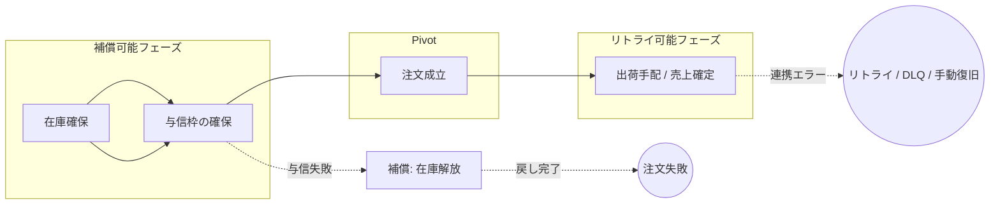

## TL;DR


:::message
本記事は、Sagaパターンについて自分で調べた内容を、実務目線で整理したものです。
一部、文章整理にAIを利用しています。
:::

## とあるECサイトにマイクロサービスが複数、何も起きないはずもなく...

ある日僕がみていたのは、マイクロサービスで構成された EC サービスの注文まわりでした。

そこで「何かあったときサービス間の整合性、どうしようかねぇ」という話をしていたところ、メンバーが Saga パターンを使った PR を出してきました。

**ぼく「あぁ...ほーん......Saga...ね...はいはい......たしかにねー...」（やばい）（あいまい）（なんだっけ）**

名前は聞いたことがある。SEGAじゃないしロマサガでもないな...
はなわの方でもないな...

とはいえノールックで Approve するなんて言語道断。
これを機にちゃんと理解しておこうと思い、ちょうどいいので記事にしておきます。

:::message
**🎯 この記事のゴール**
Sagaパターンの仕組みと、「どこまで戻して、どこから進めるか」という失敗時の状態設計（補償とリトライ）、実装パターンごとの違いが分かる状態になること。
:::

## 境界をまたぐと、1本のトランザクションで囲めない

マイクロサービスだと、サービスごとに DB が分かれてることが多いです。
そこで問題になるのが「サービス間の整合性」。

モノリスなら、注文・在庫・決済を 1 本の DB トランザクションで囲ってはい終わり〜余裕〜！！なんですが、そうもいかない。

途中で失敗したら、たとえばこういう話になります。

- 全部巻き戻す？
- 途中まで終わって、`BILLING_FAILED` みたいなステータスで止める？
- その後は管理画面から人が対応？

要するに、「ビジネス的にどういう状態なら大丈夫なんだっけ？」を決めるのが Saga だと思います。

## Sagaパターンとは何か

ざっくり言うと、こういう設計パターンです。

> 複数サービスにまたがる1つの業務処理を、各サービス内のローカルトランザクションの列として実行する。  
> 途中で失敗したら、補償トランザクションで業務的に整合した状態へ戻す。

もう少し実務寄りに言うと、Saga で決めるのはこの3つです。

- どこまで戻すか
- どこから前に進めるか
- 失敗時にどの状態で止めるか

各サービスは自分の DB への変更をその場で確定します。
在庫確保に成功したら、その時点で在庫は確保済み。
与信枠の確保に成功したら、支払い手段側にも状態が残ります。

だから Saga で考えるのは、「途中でコケたとき、最終的にどんな状態なら業務として正しいか？」です。

```text
在庫確保成功したけど決済が失敗したら？
→ 在庫は確保したまま決済失敗ステータスで止める?
→ それとも在庫も解放する？
```

## 「なかったことにする」はロールバックではなく、打ち消し

一見ロールバックに聞こえがちですが、Saga ではサービスごとに処理を確定（COMMIT）させます。

サービスをまたいだ全体を、1本の DB トランザクションみたいに自動ロールバックすることはできません。
代わりに「打ち消し（補償）」の処理を定義します。

打ち消しは **別の処理として** 走ります。
レコードを消すんじゃなくて、返金や在庫解放みたいな「逆向きの業務処理」になることが多いです。

## Sagaを構成する3つのフェーズ

Saga のトランザクションは、だいたい次の3つに分けて考えると整理しやすいです。

1. **補償可能フェーズ（Compensable）**  
   失敗したら打ち消し（補償）で論理的に元に戻せる区間
2. **Pivot（ピボット）**  
   戻し切れない境目。「ここを過ぎたらもう後戻りできない」境界点
3. **リトライ可能フェーズ（Retryable）**  
   Pivot 以降。全部なかったことにするより、リトライ / DLQ / 手動復旧で前に進める区間

## 例：ECの注文

EC の注文処理を例にします。
注文・在庫・決済・出荷が別サービスで、処理はだいたい次の順だとします。

```txt
在庫を確保する
↓
支払い手段を確認する / 与信枠を確保する
↓
注文を成立させる
↓
出荷・提供できる段階で売上を確定する
```

別サービスに分かれているので、全体を 1 本のトランザクションでは囲めません。
Saga は、この連なりに **失敗時の扱い** を付けていく設計です。



### 巻き戻す例

在庫を押さえたあと、与信枠の確保に失敗した。
→ 売上はまだ確定していないので、「売上を戻す」話にはなりません。
やるのは、押さえた在庫を戻す（補償）ことです。

### 進める例

注文は成立したのに、出荷連携だけ失敗した。
→ 注文をなかったことにするより、失敗として残してリトライや手動対応で前に進める方が自然なことが多いです。
全額返金してゼロに戻すのは、技術要件ではなく業務判断で決める話だと思います。

この2つを見比べると、Saga で決めてるのは「エラーを返すこと」だけじゃなくて、**失敗後にどの状態で止めるか** だと分かります。

Pivot を過ぎると、失敗しても全部なかったことに戻すより、注文を残したまま完了に向かう設計になりやすい。覚えておくとたたき台になります。

:::message alert
メール送信みたいな外部副作用は、取り消しにくいので Pivot 候補になりやすい操作です。

ただし、必ずしも「メール送信 = Pivot」とは限りません。
後続で訂正メールを送る、通知を遅延させる、Outbox 経由で確定後に送る、など業務要件で変わります。

大事なのは「ユーザーに何を通知した時点で、どの業務状態を約束したことになるか」を決めることだと思います。
:::

## どうやってサービス同士を連携させるか？（実装パターン）

Saga の実現方法は、大きく2種類です。

* **コレオグラフィ（Choreography）**  
  中央の制御役なし。各サービスがイベントを投げ合ってバケツリレー。独立性は高いけど、複雑になると「今どこで止まってるの？」が分かりにくくなる
* **オーケストレーション（Orchestration）**  
  中央にオーケストレーターを置いて、「次は在庫確保して」「失敗したから返金して」と指示。進捗は見えやすい反面、オーケストレーターに責務が集中しやすく、状態管理や可用性の設計が重要になります。

:::details 補足：イベント発行は Outbox もセットで考える
Saga では、あるサービスの処理が終わったあと、次のサービスへイベントやメッセージを送ることがあります。

ここで注意したいのが、

- DB更新は成功したが、イベント送信前にプロセスが落ちた
- イベントは送ったが、DB更新はロールバックされた

みたいな二重書き込み問題です。

そのため実装では、Transactional Outbox のように、DB更新と同じトランザクションで送信予定イベントを保存し、別プロセスで再試行可能に配信する設計を検討します。

Saga は「補償を考える」だけじゃなくて、「次のステップを確実に起動できるか」も重要です。
:::

## Sagaを使わない方がいいケース

Saga は便利ですが、全部に使うものではないです。

たとえば、注文・在庫・決済が同じ DB 内で完結していて、1本のローカルトランザクションで整合性を保てるなら、無理に Saga にする必要はないと思います。

あと、補償処理・リトライ・状態管理・監視・手動復旧まで設計が要るので、単純な同期処理より実装も運用も重くなります。

Saga を選ぶのは、「サービスや DB の境界をまたぐ業務処理」で、かつ「途中失敗しても業務的に正しい状態へ進められる」場合、くらいのイメージです。

## 設計するときに決めること

Saga は複数トランザクションが順次確定していくので、途中で他の処理に「中途半端な状態」を読み取られてしまうリスクがあります。

個人的には、コードを見る前にこのへんが PR Description に書かれていると、かなりレビューしやすいです。

1. 処理を **何段階に分けるか**
2. **戻し切れない境目（Pivot）** はどこか
3. 失敗時は **戻す（補償） / リトライ / 手動** のどれか
4. 打ち消しやリトライは **何度実行されても安全（冪等）** か
5. 他から中途半端な状態を触られないように **ステータスでロック（PENDING等）** をかけるか
6. メールなど **取り消せない操作** はいつやるか
7. Saga 全体の状態をどこで追跡するか

こんな感じで雑に書いても足ります。

```text
ステップ名
• 成功したら: ...
• 失敗したら: ...
→ 補償 / リトライ / 手動
```

PR の Description に書いておくと、レビュワーは助かると思います。自分も助かります。

## まとめ

Saga パターンは、サービスをまたぐ処理について **失敗したあとに業務として正しい状態へ遷移させる** 設計です。
「全部なかったことにする」がデフォルトではありません。

PR を見る前に、「どこまで戻すか」「どこから前に進めるか」「失敗時にどの状態で止めるか」を表に落とす。
ここだけ意識しておけば、「Saga ね……はいはい……」から一段階進めると思います。

## 参考

- [Pattern: Saga - microservices.io](https://microservices.io/patterns/data/saga.html)
- [Saga distributed transactions pattern - Azure Architecture Center](https://learn.microsoft.com/en-us/azure/architecture/patterns/saga)
- [Pattern: Transactional Outbox - microservices.io](https://microservices.io/patterns/data/transactional-outbox.html)
