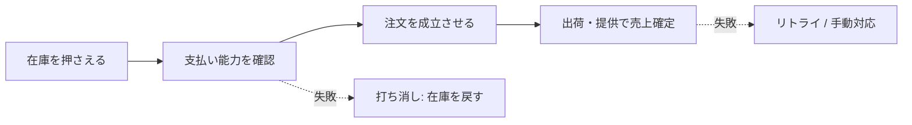

## はじめに

突然ですが皆さん！Sagaパターンって、知ってますか？

**SEGAじゃないしロマサガでもないです。もちろん、はなわの方でもありません。**

名前は聞いたことがある。
「分散トランザクションのやつでしょ？」くらいは知っている。
でも、いざコードレビューで出てくると「あれ、結局どういう設計だっけ？」となる。

今回は、そんな **どこか知っているようで、実はあんまりわかっていない Saga パターン** のお話です。

## とあるECサイトで起きた話

先日、僕がレビューしていたのは、マイクロサービスで構成された EC サービスの注文まわりでした。

そこで「例外時のサービス間の整合性、どうするのがいいかねぇ」という話をしていたところ、メンバーが Saga パターンを使った PR を出してきました。

**ぼく「あぁ...ほーん......Saga...ね...はいはい......たしかにねー...」（やばい）（あいまい）（なんだっけ）**

とはいえレビュワー。ノールックで Approve するなんて言語道断。
これを機にちゃんと理解ろう（わかろう）と思い、ちょうどいいので記事にしてみます。

## 境界をまたぐと、1本のトランザクションで囲めない

マイクロサービスでは、サービスごとに DB が分かれていることが多いです。

モノリスなら、注文・在庫・決済を 1 本の DB トランザクションで囲えたかもしれません。サービスも DB も分かれると、そうはいきません。

2 フェーズコミット（2PC）という古典的な手法もありますが、参加者が増えるほど重くなりやすい。だから現場では、**最終的に整合が取れていればよい**（結果整合性）前提で、失敗時の扱いを設計する方向に寄ることが多いです。

それが Saga パターンです。

## Sagaパターンとは何か

Saga パターンは、複数サービスにまたがる処理を **サービスごとの処理の連なり** として進める設計です。

各サービスは、自分の DB に対する変更をその場で確定します。だから途中まで成功した状態が普通に存在します。全体をまとめてロールバックはできません。

Saga で先に決めるのは、こういうことです。

> どこかのステップが失敗したとき、最終的にどんな状態なら業務として正しいか？

失敗時に自動で元に戻るわけではありません。必要なら **打ち消すための別処理** を走らせたり、リトライしたり、人が対応したりします。

:::message
用語は本記事ではあえて少なめにしています。本質は「失敗したあと、システムをどの状態に置くか」を決めておくことです。
:::

## 「全部なかったことにする」話ではない

Saga と聞くと、失敗時に全部ロールバックする話に聞こえがちです。でも、DB のロールバックとは違います。

DB のロールバックは、確定前の変更をなかったことにできます。Saga では各ステップがすでに確定しているので、打ち消しは **別の処理として** 走ります。レコードを消すのではなく、返金や在庫解放のような「逆向きの業務処理」になることが多いです。

そして、失敗したからといって必ず全部ゼロに戻すわけでもありません。商品や業務によって、正しい状態は変わります。

## 例：ECの注文（Sagaの説明用）

具体例として、僕がレビューした EC の注文処理を載せます。**ECの設計解説が目的ではなく、Sagaの考え方の例** です。

注文・在庫・決済・出荷などが別サービスになっており、処理はだいたい次の順で進みます。

```txt
在庫を押さえる
↓
支払い能力を確認する
↓
注文を成立させる
↓
出荷・提供できる段階で売上を確定する
```

別サービスに分かれているので、全体を 1 本のトランザクションでは囲めません。Saga は、この連なりに **失敗時の扱い** を付けていく設計です。



**巻き戻す例：** 在庫を押さえたあと、支払い能力の確認に失敗した。売上はまだ確定していないので、「売上を戻す」話にはなりません。やるのは、押さえた在庫を戻すことです。

**進める例：** 注文は成立したのに、出荷連携だけ失敗した。注文をなかったことにするより、失敗として残してリトライや手動対応で前に進める方が自然なことが多いです。全額返金してゼロに戻すのは、技術のデフォルトではなく業務判断です。

この2つを見比べると、Saga で決めているのは「エラーを返すこと」だけではなく、**失敗後にどの状態で止めるか** だと分かります。

中間には **戻し切れない境目** があります。Saga の文脈では、こうした境目を **Pivot** と呼ぶことがあります。
この例では「注文を成立させる」あたりがそれに当たります。ここを過ぎると、失敗しても全部なかったことに戻すより、注文を残したまま完了に向かう設計になりやすい、と覚えておくとたたき台になります。

:::message alert
確認メールは取り消しづらいです。送ったあとに後続が失敗すると、「完了メールが来たのに実は出荷できない」が起きます。通知のタイミングも設計の一部です。
:::

## 設計するときに決めること

コードより先に、次の5点を決めておくと整理しやすかったです。

1. 処理を **何段階に分けるか**
2. **戻し切れない境目** はどこか
3. 失敗時は **戻す / リトライ / 手動** のどれか
4. 打ち消し処理は **何度実行されても安全** か
5. メールなど **取り消せない操作** はいつやるか

表に落としてもよいです。ステップごとに「成功したらどうなるか」「失敗したらどうするか」だけ書けば、だいたい足ります。

## まとめ

Saga パターンは、サービスをまたぐ処理について、**失敗したあとに業務として正しい状態へ遷移させる** 設計です。「全部なかったことにする」がデフォルトではありません。

PR の実装を見る前に、「どこまで戻すか」「どこから前に進めるか」「失敗時にどの状態で止めるか」を表に落とす。正直、コードよりこの表を一緒に埋める時間の方が長かったです。

「Saga ね……はいはい……」から、一段階進めた気がします。
