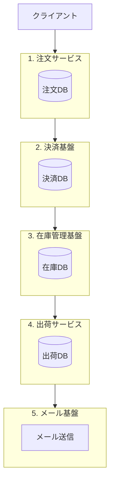
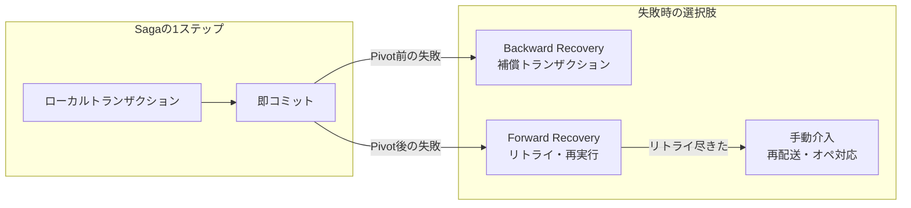

## はじめに

今日のテーマは **Sagaパターン** です。

...はい。**SEGA じゃないし SAGA 佐賀♪ の方でもありません。**

### きっかけ

僕がレビューしていたのは、マイクロサービスで構成された EC の注文まわりでした。  
サービスをまたぐ処理で「トランザクション整合性、どうするのがいいかねぇ」という話のあと、実装者が Saga パターンを使った PR を出してきました。

**ぼく「あぁ...ほーん......Saga...ね...はいはい......たしかにねー...」**

名前は知ってますが「あれでしょ？分散トランザクションのやつだよね？」くらいの理解。

とはいえレビュワーなので、僕も調べながら理解を深めていきました。今回はそんな記録をちょうどいいから記事にしちゃおう、という話です。

:::message
教科書的に完璧を目指すより、調べて腑に落ちたことを共有するスタンスで書いています。
:::

## 失敗したら全部取り消す、で合ってる？

結論から言うと、**「全部なかったことにする」がデフォルトとは限らない**です。

Saga でやるのは、各ステップをローカルトランザクションとして進め、失敗時に **ドメインとして正当な状態** へ遷移させる設計です。補償で戻すこともあれば、Pivot を過ぎたあとはリトライや手動対応になることもあります。

「表示用の在庫は減ったのに、倉庫側の引当が失敗した。じゃあ決済まで全部戻す？」  
…多くの場合、**No** に近いです。全額返金してゼロに戻すのは技術のデフォルトではなく、**ビジネス判断** になります。

この記事では、その「戻し方」を決めるのが Saga の設計だ、という話をしていきます。

## 表示用と倉庫用、なぜ別々？

EC の在庫って、最初から2つに分かれているわけじゃないことが多いです。

当初は、商品ページに出す **表示用の在庫数** も、出荷のために押さえる **倉庫側の在庫** も、同じ DB で管理していた、という話はよく聞きます（僕が触った系統もだいたいそうでした）。そのあとマイクロサービス化が進んで、販売まわりと倉庫まわりでサービスが分かれ、DB も分かれた。結果として「表示用」と「倉庫内」が別の在庫として見えるようになった、という流れです。

変な話ではなく、**歴史的経緯で境界ができた** パターンだと思っています。

問題は、境界ができたあとに「失敗したら全部ロールバックでしょ？」と考えがちなところ。僕も Saga の PR を見たときはまさにそう思っていました。

:::message
PR を読んでいて感じたのは、「補償処理の実装」そのものより **「このステップが失敗したら、最終的にどういう状態にしたいか」** の議論の方が設計の主戦場だった、ということです。
:::

## 境界をまたぐと、1本のトランザクションで囲めない

マイクロサービスではサービスごとに DB が分かれていることが大半なので、注文から出荷までを単一のトランザクションで囲めません。

古典的な解として 2 フェーズコミット（2PC）がありますが、参加者が増えるほど可用性が落ち、ロックも長くなります。マイクロサービス文脈では [結果整合性](https://microservices.io/patterns/data/saga.html) を受け入れて、失敗時の扱いをあらかじめ設計する、という方向に寄ることが多いです。

## Sagaパターンとは

Saga パターンとは **「複数のローカルトランザクションに分割した処理について、各ステップごとに失敗の扱いをセットで設計するパターン」** です。

Saga という概念自体はマイクロサービス以前の話で、[Garcia-Molina & Salem (1987)](https://doi.org/10.1145/38713.38742) の論文で、部分実行が起きたら **補償トランザクション（compensating transaction）** で修正する、と定義されています。現代の文脈では [Chris Richardson の Saga パターン](https://microservices.io/patterns/data/saga.html) がよく参照されます。

ステップ間の連携には **Choreography**（各サービスがイベントで連鎖）と **Orchestration**（中央がフローを指示）の2方式があります。僕がレビューした PR は Orchestration 寄りで、今どのステップで止まっているかを把握しやすい形でした。

:::message
どちらの文脈でも共通しているのは、**失敗時に何をするかをあらかじめ設計しておく** という点です。
:::

## EC 注文フローで見る

具体例として、よくある EC の注文フローを見てみます。

```
注文作成 → 与信確保 → 決済 → 在庫確保 → 出荷手配 → 完了通知（メール）
```

関わるサービスはだいたい次の5つです。

- **注文サービス** … 注文の作成と状態管理（Saga の起点）
- **決済基盤** … 与信・決済・返金
- **在庫管理基盤** … 表示用の販売可能在庫と引当
- **出荷サービス** … 倉庫側への出荷指示
- **メール基盤** … 確認メール・完了通知



Saga として設計するとき、各ステップについて次のことを決めます。

- このステップは **Compensable**（打ち消せる）か
- **Pivot**（帰還不能点）はどこか
- 失敗時は **補償** / **リトライ** / **異常状態の永続化** のどれを取るか

[Microsoft の Saga パターン解説](https://learn.microsoft.com/en-us/azure/architecture/patterns/saga) では、トランザクションを次の 3 種類に分類しています。

| 種類 | 意味 | 例 |
| --- | --- | --- |
| Compensable | 補償トランザクションで打ち消せる | 与信確保 → 与信解放 |
| Pivot | 帰還不能点。ここを過ぎたら補償ではなく完了に向かう | 決済完了 |
| Retryable | Pivot 以降。リトライで最終状態に到達させる | 出荷手配の再試行 |



原典の論文でも、失敗時の対応として **Backward Recovery**（補償で巻き戻す）と **Forward Recovery**（未完了ステップを再実行して完了させる）の両方が定義されています。

:::message
Saga は「失敗したら補償」だけの話ではない、というのがここでのポイントです。
:::

## Saga ≠ DB のロールバック

Saga を聞くと「失敗したらロールバックするやつ」と思いがちです。でも、それは半分正解で半分ズレています。

:::message alert
Saga ≠ DB のロールバック。各ステップは即コミットされ、補償は「なかったこと」ではなく「打ち消す新しいトランザクション」です。
:::

### ACID のロールバックとの違い

DB のトランザクションにおけるロールバックは、中間状態を他のトランザクションから隠したうえで、**なかったことにできる** ものです。

Saga の各ステップはローカルトランザクションとして **即コミット** されます。補償が走る時点では、すでに他のサービスがその状態を読んでいるかもしれません。だから補償は「巻き戻し」ではなく、**新しいトランザクションでビジネス効果を打ち消す** 操作です。

原典でもこう書かれています。補償は「意味的に（semantically）アクションを undo する」が、「T_i の開始前の状態に戻す必要はない（does not necessarily return the database to the state that existed when the execution of T_i began）」。

返金は「決済レコードを消す」のではなく「返金トランザクションを新たに作る」。在庫解放は「在庫数を元の数字に戻す」のではなく「予約をキャンセルする」。[Umur Inan の記事](https://umurinan.com/pages/posts/sagas-are-not-transactions.html) でも、補償後の注文は `CANCELLED` 状態として残り、「注文がなかった状態」とは別物だと説明されています。

:::message alert
Richardson も「Lack of automatic rollback — a developer must design compensating transactions」と明記しています。**自動ロールバックはない。設計者が補償を定義する。**
:::

### メール送信は Undo できない

メール送信を伴う処理に Saga で「全部ロールバック」は成立しません。メールが送られた時点で、それを Undo する手段はありません。

:::message alert
Microsoft のドキュメントでは、こうした操作を **Irreversible / noncompensable** なトランザクションとして扱います。不可逆な操作は Saga の **最後** に置くか、「失敗しても許容する副作用」として切り離す必要があります。
:::

### 出荷失敗で決済まで巻き戻すか？

決済 → 在庫確保 → 出荷、という流れで出荷処理に失敗したとき、決済まで全部巻き戻しますか？

:::message
多くの場合、**No** です。出荷失敗なら `SHIPPING_FAILED` のような状態を永続化し、配送担当が手動で再実行するか、システムがリトライする。お客さんには「発送準備中です、少々お待ちください」と連絡する。全額返金して注文をなかったことにするのは、**ビジネス判断** であり、技術的なデフォルトではありません。
:::

ここが Saga パターンの設計でいちばん悩むところだと思っています。

:::message
Saga は「異常時にシステムをどの正当な状態に置くか」を、ドメインの関心ごとに定義するもの。全部ゼロに戻すのが正解とは限らない。異常が起きたときに、ビジネスとしてどうあるべきかを決めておく。それが Saga パターンの設計作業です。
:::

## 実務で使う設計フレーム

PR を読みながら、設計時に確認したいことをチェックリストにまとめました。

### ステップごとの設計表

各ステップについて、次の 4 列を埋めます。

| ステップ | 成功時の状態 | 失敗時の状態 | 対応（補償 / リトライ / 手動） |
| --- | --- | --- | --- |
| 与信確保 | CREDIT_RESERVED | — | 補償: 与信解放 |
| 決済 | PAYMENT_CAPTURED | PAYMENT_FAILED | 補償: 与信解放 |
| 在庫確保 | INVENTORY_RESERVED | — | 補償: 在庫解放 + 返金 |
| 出荷手配 | SHIPPED | SHIPPING_FAILED | リトライ → 手動再配送 |
| 完了通知 | NOTIFIED | — | noncompensable（許容 or 最後に配置） |

### 設計時のチェックポイント

1. Pivot を決める。ここを過ぎたら refund ではなく retry / manual が基本
2. 不可逆操作を後ろに置く。メール、外部 API 呼び出し、物理出荷
3. 補償は冪等にする。リトライで二重返金しない（idempotency key）
4. 補償失敗の逃げ道を用意する。stuck saga の検知、DLQ、手動介入フロー
5. 中間状態が見えることを前提にする。Saga には ACID の Isolation がない。実行中の `PAYMENT_CAPTURED` を他サービスが読む可能性がある

:::message alert
Saga 実行中、各ステップは即コミットされるので、`PENDING` → `PAYMENT_CAPTURED` → `INVENTORY_RESERVED` のような中間状態が外部から見えます。確認メールを早く送りすぎると、後から補償で `FAILED` になったときに困ります。
:::

## まとめ

:::message
Saga パターンは、分散環境で複数ステップの業務処理を調整するための設計パターンです。失敗時に「全部なかったことにする」のではなく、ドメインとして正当な状態に遷移させるのが設計の中心になります。補償（Backward Recovery）だけでなく、リトライ（Forward Recovery）や手動介入も選択肢に入れます。不可逆な操作（メール送信など）は、設計段階で意識的に扱う必要があります。
:::

「Saga ね……はいはい……」から一段階進めた気がします。次にもう一段深く読むなら、下の参考文献がおすすめです。

## 参考文献

- Garcia-Molina, H. & Salem, K. (1987). [Sagas](https://doi.org/10.1145/38713.38742)
- Chris Richardson. [Pattern: Saga](https://microservices.io/patterns/data/saga.html)
- Microsoft. [Saga distributed transactions pattern](https://learn.microsoft.com/en-us/azure/architecture/patterns/saga)
- Umur Inan. [Sagas Are Not Transactions](https://umurinan.com/pages/posts/sagas-are-not-transactions.html)
